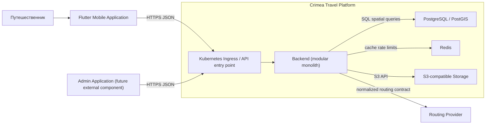

# Container diagram

Это целевое предварительное представление, а не текущая local Compose topology.
Backend остаётся одним deployable container с внутренними domain modules.

`Admin Application` показан как будущий внешний клиент. Он не создаётся на
foundation-этапе. `Kubernetes Ingress` относится к целевой deployment topology;
local Compose не запускает Kubernetes.
