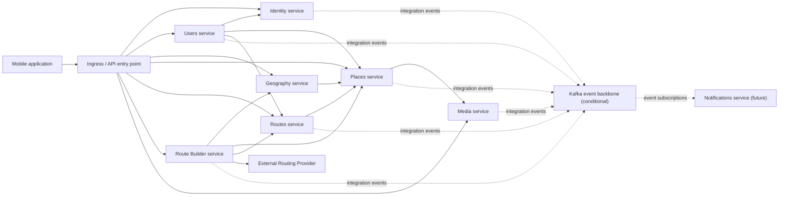

# Карта возможных domain services

Диаграмма показывает возможное будущее выделение services, а не текущую
deployment topology. На первом этапе все области находятся в modular monolith.

Стрелки обозначают logical contracts. Они не разрешают совместное владение
tables или cross-service ORM relations. Выделение любого service требует
измеримой эксплуатационной причины согласно ADR-001.

`Ingress / API entry point` не является отдельным domain service или
обязательным API gateway. На первом этапе запросы направляются в единый backend.

Пунктирные связи обозначают возможный asynchronous flow после выполнения
критериев ADR-005. Kafka не заменяет synchronous APIs и отсутствует в текущей
deployment topology.
