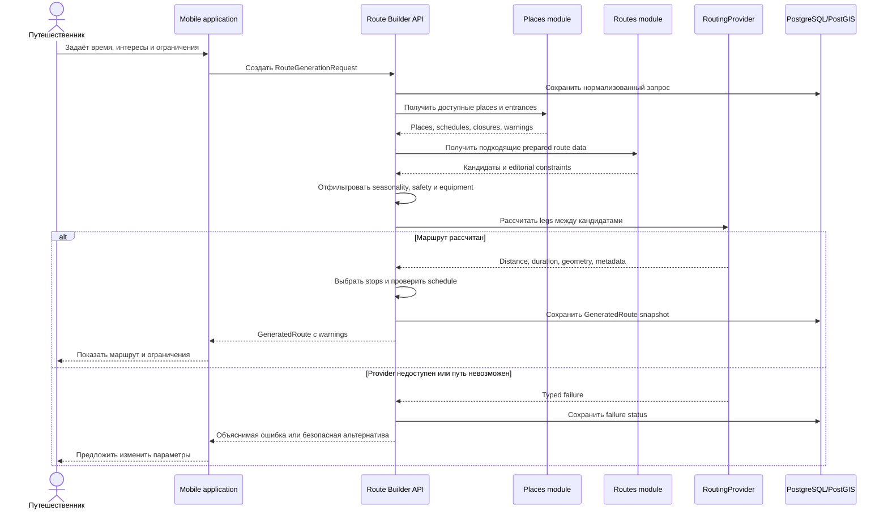

# Поток генерации маршрута

На первом этапе `RoutingProvider` реализован deterministic stub. Даже после
подключения реального provider финальная проверка closure, schedule, safety,
equipment и freshness остаётся ответственностью платформы.
