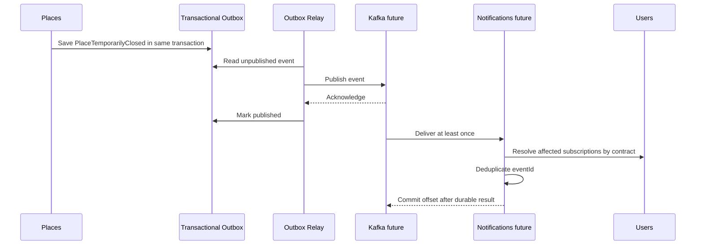

# Предварительный event catalog

## Статус документа

Catalog описывает возможные integration events целевой architecture. Он не
является подтверждением существующих topics, producers или consumers. Kafka
runtime на foundation-этапе отсутствует.

Events появляются только после изменения authoritative state и описывают
свершившийся business fact. Commands и synchronous queries в catalog не входят.

## Standard envelope

Предварительный transport-neutral envelope:

| Field | Назначение |
| --- | --- |
| `eventId` | Глобально уникальный event UUID |
| `eventType` | Stable event name |
| `eventVersion` | Major contract version |
| `occurredAt` | Время business change в UTC |
| `publishedAt` | Время публикации relay |
| `producer` | Domain owner события |
| `aggregateType` | Тип aggregate |
| `aggregateId` | Partition и correlation key |
| `correlationId` | Связь одного пользовательского или системного flow |
| `causationId` | Command или event, вызвавший изменение |
| `payload` | Versioned event data |

Envelope не содержит broker offsets, partition или headers, специфичные для
Kafka. Эти значения принадлежат infrastructure adapter.

## Candidate events

### Places

| Event | Producer | Возможные consumers | Business trigger |
| --- | --- | --- | --- |
| `PlacePublished.v1` | `places` | `routes`, search, notifications | Place впервые опубликован |
| `PlaceUpdated.v1` | `places` | `routes`, search, notifications | Изменились публично значимые данные |
| `PlaceTemporarilyClosed.v1` | `places` | `routes`, `route_builder`, notifications | Подтверждено временное закрытие |
| `PlaceReopened.v1` | `places` | `routes`, `route_builder`, notifications | Закрытие отменено или завершилось |
| `PlaceArchived.v1` | `places` | `routes`, search, notifications | Place исключён из публикации |

`PlaceUpdated` не должен передавать полную ORM row. Payload содержит только
идентификатор, changed field groups, publication status, source freshness и
revision. Consumers получают необходимую detail projection через собственный
contract или rebuild process.

Ordering key: `placeId`.

### Prepared routes

| Event | Producer | Возможные consumers | Business trigger |
| --- | --- | --- | --- |
| `PreparedRoutePublished.v1` | `routes` | search, notifications | Editorial route опубликован |
| `PreparedRouteUpdated.v1` | `routes` | users, notifications | Изменены stops или ограничения |
| `PreparedRouteSuspended.v1` | `routes` | users, notifications | Route временно недоступен |
| `PreparedRouteArchived.v1` | `routes` | users, search | Route снят с публикации |

Ordering key: `preparedRouteId`.

### Route builder

| Event | Producer | Возможные consumers | Business trigger |
| --- | --- | --- | --- |
| `RouteGenerationCompleted.v1` | `route_builder` | users, notifications, analytics | GeneratedRoute успешно сохранён |
| `RouteGenerationFailed.v1` | `route_builder` | notifications, operations analytics | Попытка завершилась typed failure |
| `GeneratedRouteInvalidated.v1` | `route_builder` | users, notifications | Изменение данных сделало snapshot небезопасным |

Payload результата содержит IDs, summary, warnings и algorithm version, но не
полную geometry. Geometry читается через authorized API или object reference,
чтобы не создавать большие broker messages.

Ordering key: `routeGenerationRequestId`.

### Media

| Event | Producer | Возможные consumers | Business trigger |
| --- | --- | --- | --- |
| `MediaAssetProcessed.v1` | `media` | places, routes | Проверка и transformations завершены |
| `MediaAssetRejected.v1` | `media` | places, operations | Asset отклонён |
| `MediaAssetArchived.v1` | `media` | places, routes | Media больше нельзя публиковать |

Payload не содержит binary content. Передаются asset ID, safe metadata,
variants и rights status.

Ordering key: `mediaAssetId`.

### Identity и users

| Event | Producer | Возможные consumers | Business trigger |
| --- | --- | --- | --- |
| `UserRegistered.v1` | `identity` | users, notifications | Account создан |
| `UserAccountDisabled.v1` | `identity` | users, security audit | Account заблокирован |
| `FavoritePlaceAdded.v1` | `users` | recommendations, analytics | User сохранил place |
| `SavedRouteCreated.v1` | `users` | offline preparation, analytics | User сохранил route |

Events identity и users требуют отдельного privacy review. Email, password
hash, token, avatar URL и точные coordinates в payload не включаются. Для
analytics предпочтительны pseudonymous identifiers и aggregate metrics.

Ordering key: `userId`.

## Future notification flow

Notifications являются возможным независимым consumer, но отдельный service
сейчас не создаётся.

## Запрещённые применения

Kafka не используется для:

- проверки access token или permissions на request path;
- synchronous login и registration response;
- чтения place card или route card;
- передачи commands, которым требуется немедленный business result;
- совместного владения state между domains;
- обхода public application contracts;
- передачи secrets, binary media или неограниченной route geometry.

## Contract lifecycle

Перед активацией каждого event необходимо:

1. Назначить domain owner.
2. Описать business trigger и authoritative state.
3. Определить schema и compatibility tests.
4. Зафиксировать partition key и ordering expectations.
5. Классифицировать data и retention.
6. Описать idempotency, retry и dead-letter behavior consumers.
7. Определить replay procedure.
8. Добавить metrics, traces и operational owner.

Удаление event version допускается только после подтверждения отсутствия
активных consumers и истечения согласованного retention period.
