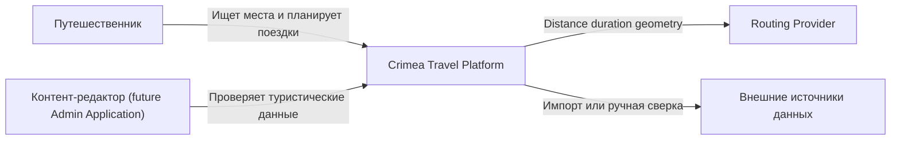

# Системный контекст

Crimea Travel Platform состоит из mobile application, backend API и
инфраструктурных сервисов. На первом этапе backend реализуется как modular
monolith. Внешние поставщики маршрутизации скрыты за `RoutingProvider`.

## Границы ответственности

Платформа отвечает за:

- учётные записи и пользовательские данные;
- административную географию и каталог мест;
- подготовленные и сгенерированные маршруты;
- происхождение, freshness и публикационный статус контента;
- orchestration построения маршрута и нормализацию ответа provider.

Платформа не гарантирует безошибочность сторонней маршрутизации, не заменяет
официальные предупреждения экстренных служб и не является государственным
источником информации.
